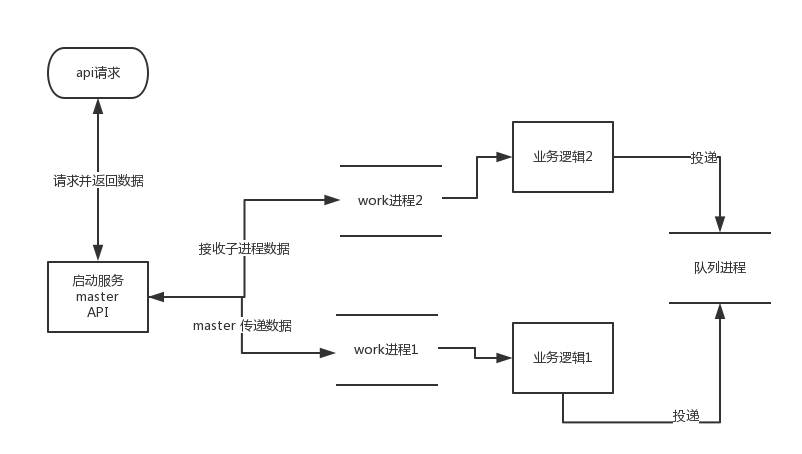

#swoole-server-manager
swoole 服务管理框架

###目录
* 说明
* 特色
* 流程图
* 运行
* TODO

1. 说明
--------------
    像后台常驻服务，agent这类的用go开发都比较多。优点就不说了(性能，兼容好，开发相对快)。
最近要写个后台服务，可能还是php写多了(go写了点还是不顺手，怪我笨)，还是用php写吧，刚好可以用swoole处理进程之间的工作，
所以便有了此项目。

此项目为后台服务开发提供了一些常用的功能（个人认为)

+ 后台服务需要常驻后台，完成不同的业务功能。此处可以把业务按子进程分开
+ 子进程和主进程(master) 需要进行双向通信。(传递各个子进程的业务信息或者子进程接收master的命令执行相关业务)
+ 后台服务需要提供api, 进行服务(子进程)管理，比如返回子进程的状态，信息，开启关闭不同的子进程等
+ 子进程异常退出，master能够自动拉起(这个swoole 已经做好了)
+ 子进程内执行的业务也可能遇到堵塞的情况，所以加了队列功能进行业务异步的处理(放弃swoole的task)

2. 特色
--------------
+ 基于最新swoole
+ 针对后台常驻服务相关开发的框架
+ 使用 resque (redis队列)处理耗时流程处理
+ 支持动态增加相关服务进程(通过api)
+ 方便扩展的api, 后台服务进程

3. 流程图
--------------

4. 运行
--------------
一个简单的demo

运行

    php demo/simple.php
   
   
code

    <?php

    require dirname(__DIR__) . '/autoload.php';

    //队列的基本设置
    ServerManager\Queue\Queue::setConfig([
        'host' => 'localhost:6379',
        'name' => 'default',
        'classBase' => 'ServerManager\demo\simple\queue'
    ]);
    
    //框架实例
    $server = new ServerManager\Manager\Server();
    
    //设置服务api类
    $server->setApiClassName('ServerManager\demo\simple\TestController');
    
    //设置 process 设置
    $server->setProcessConfig([
    
        //服务子进程名称，唯一，如果进程类代码都一样，还是请设置不同的名字。
        'process_name' => [
            //子进程类
            'class' => 'ServerManager\demo\simple\process\DemoServer',
            //子进程启动入参
            'params' => ['data' => 1]
    
        ],
    
        'process_name_two' => [
            'class' => 'ServerManager\demo\simple\process\DemoServer',
            'params' => ['data' => 2]
        ]
    
    
    ]);
    
    //启动唠
    $server->run();
    

####api访问
访问 http://127.0.0.1:9501/api/index
路由指到 src/demo/simple/TestController.php => actionIndex
TestController内可进行扩展。

####主进程与子进程通信
访问 http://127.0.0.1:9501/api/status
路由指到 src/demo/simple/TestController.php => actionStatus

	public function actionStatus()
	{

		//向所有子进程发送status命令
		$this->_manager->sendCommandAll('status');

        //堵塞接收所有子进程返回status命令的执行结果
        $result = $this->_manager->getCommandAll();

        var_dump($result);

        return $result;

	}
    
    
子进程处理`status`命令，返回执行结果
src/demo/simple/process/DemoServer.php => commandStatus
     
    public function commandStatus()
    {

        return [
            'name' => $this->name,
            'count' => $this->params['data'] * 2,
            'error' => 20
        ];
    }

####子进程内队列的使用
访问 http://127.0.0.1:9501/api/queue
路由指到 src/demo/simple/TestController.php => actionQueue

	/**
     * 测试 process 发送 queue
     */
    public function actionQueue()
    {

        $this->_manager->sendCommand('process_name_two', 'queue', 'queue_1');

    }
    
    
子进程`process_name_two`执行`queue`命令
    
    public function commandQueue()
    {

        $data = [
            'email' => 'test@qq.com',
            'text' => 'hello ! ' . $this->name,
            'date' => date('Y-m-d H:i:s')
        ];

        //子进程内投递队列，第一个参数：队列work类名
        $this->sendQueue('EmailWork', $data);

    }
    
队列`EmailWork` 对应文件 ServerManager\demo\simple\queue\EmailWork
`work`写法参照php-resque

		
	class EmailWork extends \ServerManager\Queue\Queue
	{
	
	
	    public function perform()
	    {
	        // Work work work
	        var_dump($this->args);
	    }
	
	
	
	}
    

5. TODO
--------------
+ 子进程增加接口实现
+ 子进程删除接口实现
+ 子进程异常，会堵塞master与子进程间的通信
+ 队列现在只有一个进程处理，考虑任意多进程处理

